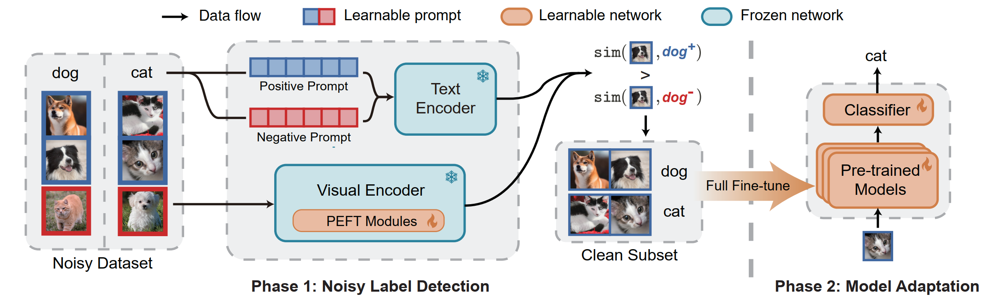

# [NeurIPS'24] Vision-Language Models are Strong Noisy Label Detectors
PyTorch Code for the following paper at NeurIPS2024

<b>Title</b>: <i>Vision-Language Models are Strong Noisy Label Detectors</i>

<b>Abstract</b>
Recent research on fine-tuning vision-language models has demonstrated impressive performance in various downstream tasks. However, the challenge of obtaining accurately labeled data in real-world applications poses a significant obstacle during the fine-tuning process. To address this challenge, this paper presents a Denoising Fine-Tuning framework, called DeFT, for adapting vision-language models. DeFT utilizes the robust alignment of textual and visual features pre-trained on millions of auxiliary image-text pairs to sieve out noisy labels. The proposed framework establishes a noisy label detector by learning positive and negative textual prompts for each class. The positive prompt seeks to reveal distinctive features of the class, while the negative prompt serves as a learnable threshold for separating clean and noisy samples. We employ parameter-efficient fine-tuning for the adaptation of a pre-trained visual encoder to promote its alignment with the learned textual prompts. As a general framework, DeFT can seamlessly fine-tune many pre-trained models to downstream tasks by utilizing carefully selected clean samples. Experimental results on seven synthetic and real-world noisy datasets validate the effectiveness of DeFT in both noisy label detection and image classification.

<b>Illustration</b>



<b>Environment</b>

* Python 3.8

* PyTorch 2.0

* Torchvision 0.15

<b>Experiments</b>

First, install dependencies listed in `requirements.txt`:

```sh
pip install -r requirements.txt
```

Next, make a directory to store your dataset and change the path in the configure files in [config](config).

```sh
mkdir path_to_your_data
```

Then, run the following commands to experiment on noisy CIFAR-100 with 20% symmetric noise:

```sh
# Phase1: Noisy Label Detection
python main_phase1.py --cfg "./config/PEFT/cifar100.yaml" --noise_mode sym --noise_ratio 0.2
# Phase2: Model Adaptation
python main_phase2.py --cfg "./config/FFT/cifar100.yaml" --noise_mode sym --noise_ratio 0.2
```

You can reproduce other results in the paper by the following commands:

```sh
# 1. Experiment on synthetic dataset with instant-dependent noise
python main_phase1.py --cfg "./config/PEFT/cifar100.yaml" --noise_mode idn --noise_ratio 0.2
python main_phase2.py --cfg "./config/FFT/cifar100.yaml" --noise_mode idn --noise_ratio 0.2

# 2. Experiment on real-world dataset
python main_real_phase1.py --cfg "./config/PEFT/clothing1m.yaml"
python main_real_phase2.py --cfg "./config/FFT/clothing1m.yaml"

# 3. Reproduce the baseline results
# small-loss strategy
python main_small_loss.py --cfg "./config/PEFT/cifar100.yaml" --noise_mode sym --noise_ratio 0.2
# label-noise learning methods
python main_baseline.py --cfg "./config/FFT/cifar100.yaml" --noise_mode sym --noise_ratio 0.2 --lnl_methods GMM
python main_real_baseline.py --cfg "./config/FFT/clothing1m.yaml" --lnl_methods GMM
```

<b>Acknowledgement</b>\
Thanks the following repositories for code reference: [LIFT](https://github.com/shijxcs/LIFT), [CoOp](https://github.com/KaiyangZhou/CoOp), [CLIPN](https://github.com/xmed-lab/CLIPN) and [DivideMix](https://github.com/LiJunnan1992/DivideMix).

<b>Citation</b>\
If you find the code useful in your research, please consider citing our paper:
```bibtex
@inproceedings{wei2024deft,
  title={Vision-Language Models are Strong Noisy Label Detectors},
  author={Tong Wei and Hao-Tian Li and Chun-Shu Li and Jiang-Xin Shi and Yu-Feng Li and Min-Ling Zhang},
  booktitle={Advances in Neural Information Processing Systems 37},
  year={2024}
}
```

<b>License</b>\
This project is licensed under the terms of the MIT license.
